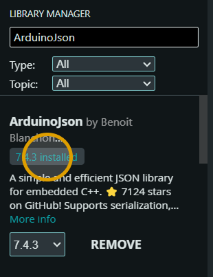

# SkyPointer

**Flight tracking device for hobbyists**

Simple build guide for the SkyPointer prototype.

---

## What is SkyPointer?

SkyPointer is a small physical flight tracker for people who like watching airplanes.

It uses live flight data from an online API to find the closest plane near the user. The NodeMCU reads this data and calculates where the plane is.

The product uses two motors:

- A **stepper motor** turns the pointer left or right to show the direction of the plane.
- A **servo motor** moves the pointer up or down to show how high the plane is in the sky.

When SkyPointer starts, the user first points it to **North**. After 30 seconds, the system saves that position and starts searching for nearby planes.

The goal is to make plane spotting easier because the user can simply follow the pointer and know where to look.

### System flow

---

## Parts needed to create this

To build SkyPointer you need the following parts:

- NodeMCU ESP8266
- 28BYJ-48 5V stepper motor
- ULN2003 stepper driver board
- 1× 9g positional servo
- External regulated 5V power supply, around 1–2A
- Jumper wires / breadboard
- Wi-Fi or phone hotspot
- Arduino IDE

### Main components

<table>
  <tr>
    <td align="center">
       
      <b>NodeMCU ESP8266</b>
    </td>
    <td align="center">
       
      <b>28BYJ-48 Stepper Motor</b>
    </td>
    <td align="center">
       
      <b>9g Servo Motor</b>
    </td>
  </tr>
</table>

The **ULN2003 driver board** is used between the NodeMCU and the stepper motor.

The 28BYJ-48 stepper motor normally plugs directly into this driver board.

### Where to buy the parts

You can buy these parts from electronics shops such as TinyTronics or Conrad.

- **NodeMCU ESP8266:**  
  [TinyTronics](https://www.tinytronics.nl/en/development-boards/microcontroller-boards/with-wi-fi/esp8266-nodemcu-v2)

- **28BYJ-48 Stepper Motor + ULN2003 driver:**  
  [Conrad](https://www.conrad.nl/nl/p/whadda-wpi401-stappenmotorbesturingsmodule-geschikt-voor-serie-arduino-1-stuk-s-2330784.html)

- **SG90 9g Servo Motor:**  
  [TinyTronics](https://www.tinytronics.nl/en/mechanics-and-actuators/motors/servomotors/sg90-mini-servo)

- **External power supply:**  
  [TinyTronics adjustable power supply](https://www.tinytronics.nl/nl/power/voedingen/12v/goobay-64570-universele-voedingsadapter-verstelbaar-3-12v-2.25a)

> You do not have to buy exactly these products. Similar components with the same specifications can also be used.

### Getting the 5V power supply

The stepper motor and servo need their own power supply.

The NodeMCU should not power both motors directly because the motors can use more current than the NodeMCU can safely provide.

For this prototype you can use an external power supply of around:

**5V and 1–2A**

An adjustable power supply can also be used. Before connecting it to the prototype, make sure it is set to **5V**.

The positive **5V** connection will later be connected to the stepper motor driver and the servo motor.

The **GND** connection will also be connected to the NodeMCU so that all parts share the same ground.

The exact wiring is explained later in the **Wiring** section.

---

## Software setup

### Install the ESP8266 board package
Before we start, we need to install the Arduino IDE and have the NodeMCU connected with it. I have uploaded a PDF file for a guide on how to install the IDE and on how to connect the NodeMCU with your device.

### Install ArduinoJson
Its time to start with the Arduino program. Once you have it opened. There is an icon on the left that looks like a bunch of books placed next to each other. Click on that to search the libraries. 

Search for ArduinoJson — by Benoit Blanchon
Used to read the aircraft data from the API.
Click on install. 

### Install AccelStepper

### Adjusting the code

---

## Wiring

### Connecting the stepper motor

### Connecting the servo motor

### Connecting the 5V power supply

---

## Testing the prototype

### Testing the flight data

### Testing the stepper motor

### Testing the servo motor

---

## Problems and solutions

---

## Sources
