# SkyPointer
**Flight tracking device for hobbyists**

Simple build guide for the SkyPointer prototype.

---

## What is SkyPointer?
SkyPointer is a small physical flight tracker for people who like watching airplanes.
It uses live flight data from an online API to find the closest plane near the user. The NodeMCU reads this data and calculates where the plane is.

### System flow
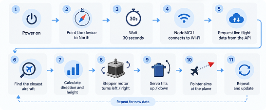

---

## Parts needed to create this
To build SkyPointer you need the following parts:
- NodeMCU ESP8266
- 28BYJ-48 5V stepper motor
- ULN2003 stepper driver board
- 1× 9g positional servo
- External regulated 5V power supply, around 1–2A
- Jumper wires / breadboard
- Wi-Fi or phone hotspot
- Arduino IDE

### Main components
<table>
  <tr>
    <td align="center">
      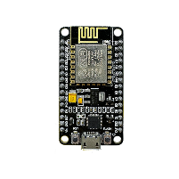<br>
      <b>NodeMCU ESP8266</b>
    </td>
    <td align="center">
      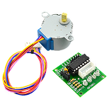<br>
      <b>28BYJ-48 Stepper Motor</b>
    </td>
    <td align="center">
      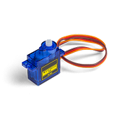<br>
      <b>9g Servo Motor</b>
    </td>
  </tr>
</table>
The ULN2003 driver board is used between the NodeMCU and the stepper motor. The 28BYJ-48 stepper motor normally plugs directly into this driver board.

### Where to buy the parts
You can buy these parts from electronics shops such as TinyTronics or Conrad.

- NodeMCU ESP8266: [TinyTronics](https://www.tinytronics.nl/en/development-boards/microcontroller-boards/with-wi-fi/esp8266-nodemcu-v2)
- 28BYJ-48 Stepper Motor + ULN2003 driver: [Conrad](https://www.conrad.nl/nl/p/whadda-wpi401-stappenmotorbesturingsmodule-geschikt-voor-serie-arduino-1-stuk-s-2330784.html)
- SG90 9g Servo Motor: [TinyTronics](https://www.tinytronics.nl/en/mechanics-and-actuators/motors/servomotors/sg90-mini-servo)
- External power supply: [TinyTronics adjustable power supply](https://www.tinytronics.nl/nl/power/voedingen/12v/goobay-64570-universele-voedingsadapter-verstelbaar-3-12v-2.25a)

You do not have to buy exactly these products. Similar components with the same specifications can also be used.

### Getting the 5V power supply
Use a separate 5V, 1–2A power supply for the stepper motor and servo.
Do not power the motors from the NodeMCU.
Connect:
- 5V : stepper driver and servo
- GND : stepper driver, servo, and NodeMCU
Set an adjustable power supply to 5V before connecting it.

---

## Software setup

### Install the ESP8266 board package
Before we start, we need to install the Arduino IDE and connect the NodeMCU to the computer.
I have added a PDF guide that explains how to install the Arduino IDE and how to connect the NodeMCU to your device.

### Install ArduinoJson
Now we can start with the Arduino program.
Open the Arduino IDE.
On the left side you will see an icon that looks like a group of books. Click on this icon to open the Library Manager

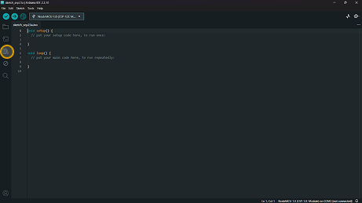

In the search bar, search for ArduinoJson by Benoit Blanchon.
ArduinoJson is used to read the aircraft data that comes from the API.

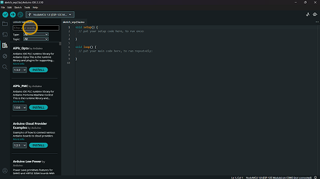

Click Install.


ArduinoJson is now installed.

### Install AccelStepper
Search for AccelStepper — by Mike McCauley
Used to control the 28BYJ-48 stepper motor.
Click on install. 
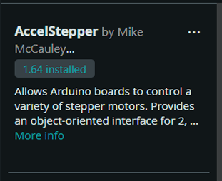

### Adjusting the code
Now that the libraries are installed, we need to adjust the code so it uses your Wi-Fi and your current location.
#### The Code
Click on **File** in the top-left corner of the Arduino IDE.
Then click New Sketch.
This will open a new place where you can add your code.
Copy the code below and paste it into the new sketch.
<details>
<summary><b>Click here to show the SkyPointer code</b></summary>
  
```cpp
#include <ESP8266WiFi.h>
#include <WiFiClientSecure.h>
#include <ESP8266HTTPClient.h>
#include <ArduinoJson.h>
#include <AccelStepper.h>
#include <Servo.h>

// =====================================================
// WIFI
// =====================================================

#define WIFI_SSID "YOUR_WIFI_NAME"
#define WIFI_PASSWORD "YOUR_WIFI_PASSWORD"


// =====================================================
// YOUR LOCATION
// =====================================================

const float MY_LAT = 52.049380;
const float MY_LON = 5.278542;

// Search radius in nautical miles
const int RADIUS = 50;


// =====================================================
// STEPPER MOTOR
// 28BYJ-48 + ULN2003
// =====================================================

#define IN1 D1
#define IN2 D2
#define IN3 D5
#define IN4 D6

// Around one full rotation
const long STEPS_PER_REVOLUTION = 4096;

AccelStepper directionStepper(
  AccelStepper::HALF4WIRE,
  IN1,
  IN3,
  IN2,
  IN4
);


// =====================================================
// SERVO MOTOR
// =====================================================

Servo skyServo;


// =====================================================
// INTERNET
// =====================================================

WiFiClientSecure client;


// =====================================================
// SETUP
// =====================================================

void setup()
{
  Serial.begin(115200);
  Serial.println();

  // ---------------------------------
  // STEPPER SETUP
  // ---------------------------------

  directionStepper.setMaxSpeed(500);
  directionStepper.setAcceleration(300);

  // Release the stepper motor
  // so the pointer can be set to North
  directionStepper.disableOutputs();


  // ---------------------------------
  // SERVO SETUP
  // ---------------------------------

  skyServo.attach(D7);

  // Start at the horizon
  skyServo.write(0);


  // ---------------------------------
  // CONNECT TO WIFI
  // ---------------------------------

  Serial.print("Connecting to WiFi");

  WiFi.begin(WIFI_SSID, WIFI_PASSWORD);

  while (WiFi.status() != WL_CONNECTED)
  {
    delay(500);
    Serial.print(".");
  }

  Serial.println();
  Serial.println("WiFi connected!");

  client.setInsecure();


  // =================================================
  // NORTH SETUP
  // =================================================

  Serial.println();
  Serial.println("=========================");
  Serial.println("POINT THE ARROW NORTH");
  Serial.println("=========================");
  Serial.println();
  Serial.println("Turn the pointer so it");
  Serial.println("points North.");
  Serial.println();
  Serial.println("You have 30 seconds.");
  Serial.println();


  // 30 second countdown
  for (int i = 30; i > 0; i--)
  {
    Serial.print("Starting in ");
    Serial.print(i);
    Serial.println(" seconds");

    delay(1000);
  }


  // Current position becomes North
  directionStepper.setCurrentPosition(0);

  // Turn stepper motor back on
  directionStepper.enableOutputs();


  Serial.println();
  Serial.println("=========================");
  Serial.println("NORTH SAVED!");
  Serial.println("0 degrees = North");
  Serial.println("=========================");
  Serial.println();

  delay(1000);

  Serial.println("Searching for closest plane...");
}


// =====================================================
// LOOP
// =====================================================

void loop()
{
  if (WiFi.status() == WL_CONNECTED)
  {
    getClosestPlane();
  }

  Serial.println();
  Serial.println("Next update in 30 seconds...");
  Serial.println();

  delay(30000);
}


// =====================================================
// GET CLOSEST PLANE
// =====================================================

void getClosestPlane()
{
  HTTPClient https;

  String url =
    "https://api.adsb.lol/v2/closest/" +
    String(MY_LAT, 6) + "/" +
    String(MY_LON, 6) + "/" +
    String(RADIUS);

  Serial.println();
  Serial.println("Searching for closest plane...");

  if (https.begin(client, url))
  {
    int httpCode = https.GET();


    // ---------------------------------
    // API WORKED
    // ---------------------------------

    if (httpCode == 200)
    {
      String payload = https.getString();

      DynamicJsonDocument doc(8192);

      DeserializationError error =
        deserializeJson(doc, payload);


      // JSON ERROR
      if (error)
      {
        Serial.println("JSON error!");

        https.end();
        return;
      }


      JsonArray aircraft = doc["ac"];


      // ---------------------------------
      // PLANE FOUND
      // ---------------------------------

      if (aircraft.size() > 0)
      {
        JsonObject plane = aircraft[0];


        // ---------------------------------
        // PLANE DATA
        // ---------------------------------

        const char* callsign =
          plane["flight"] | "Unknown";

        const char* registration =
          plane["r"] | "Unknown";

        const char* type =
          plane["t"] | "Unknown";

        float planeLat =
          plane["lat"] | 0.0;

        float planeLon =
          plane["lon"] | 0.0;

        float speed =
          plane["gs"] | 0.0;


        // =================================================
        // ALTITUDE
        // =================================================

        float altitudeFeet = 0;

        if (plane["alt_baro"].is<const char*>())
        {
          String altitudeText =
            plane["alt_baro"].as<const char*>();

          if (altitudeText == "ground")
          {
            altitudeFeet = 0;
          }
        }
        else
        {
          altitudeFeet =
            plane["alt_baro"] | 0.0;
        }


        // =================================================
        // DISTANCE
        // =================================================

        float distanceKm =
          calculateDistance(
            MY_LAT,
            MY_LON,
            planeLat,
            planeLon
          );


        // =================================================
        // DIRECTION / BEARING
        // =================================================

        float bearing =
          calculateBearing(
            MY_LAT,
            MY_LON,
            planeLat,
            planeLon
          );


        // =================================================
        // SKY ELEVATION
        // =================================================

        float altitudeMeters =
          altitudeFeet * 0.3048;

        float distanceMeters =
          distanceKm * 1000;

        float elevationAngle =
          atan2(
            altitudeMeters,
            distanceMeters
          ) * 180.0 / PI;


        elevationAngle =
          constrain(
            elevationAngle,
            0,
            90
          );


        // =================================================
        // MOVE DIRECTION STEPPER
        // =================================================

        moveStepperToBearing(bearing);


        // =================================================
        // MOVE SKY SERVO
        // =================================================

        int skyAngle =
          (int)elevationAngle;

        skyServo.write(skyAngle);


        // =================================================
        // SERIAL MONITOR
        // =================================================

        Serial.println();
        Serial.println("-------------------------");
        Serial.println("CLOSEST AIRCRAFT");
        Serial.println("-------------------------");

        Serial.print("Callsign: ");
        Serial.println(callsign);

        Serial.print("Registration: ");
        Serial.println(registration);

        Serial.print("Aircraft type: ");
        Serial.println(type);

        Serial.print("Altitude: ");
        Serial.print(altitudeFeet);
        Serial.println(" ft");

        Serial.print("Speed: ");
        Serial.print(speed);
        Serial.println(" knots");

        Serial.println();

        Serial.print("Distance: ");
        Serial.print(distanceKm);
        Serial.println(" km");

        Serial.print("Bearing from North: ");
        Serial.print(bearing);
        Serial.println(" degrees");

        Serial.print("Sky elevation: ");
        Serial.print(elevationAngle);
        Serial.println(" degrees");

        Serial.println();

        Serial.print("Stepper points to: ");
        Serial.print(bearing);
        Serial.println(" degrees");

        Serial.print("Sky servo: ");
        Serial.print(skyAngle);
        Serial.println(" degrees");

        Serial.println("-------------------------");
      }


      // ---------------------------------
      // NO PLANE FOUND
      // ---------------------------------

      else
      {
        Serial.println("No aircraft found nearby.");
      }
    }


    // ---------------------------------
    // API ERROR
    // ---------------------------------

    else
    {
      Serial.print("HTTP error: ");
      Serial.println(httpCode);
    }


    https.end();
  }


  // ---------------------------------
  // CONNECTION ERROR
  // ---------------------------------

  else
  {
    Serial.println("Could not connect to API.");
  }
}


// =====================================================
// MOVE STEPPER TO PLANE DIRECTION
// =====================================================

void moveStepperToBearing(float bearing)
{
  // Convert 0 - 360 degrees
  // into motor steps

  long targetSteps =
    (bearing / 360.0) *
    STEPS_PER_REVOLUTION;


  // Find current position
  // inside one full rotation

  long currentSteps =
    directionStepper.currentPosition()
    % STEPS_PER_REVOLUTION;


  if (currentSteps < 0)
  {
    currentSteps +=
      STEPS_PER_REVOLUTION;
  }


  // Calculate how far to move

  long difference =
    targetSteps - currentSteps;


  // Take the shortest way around

  if (difference >
      STEPS_PER_REVOLUTION / 2)
  {
    difference -=
      STEPS_PER_REVOLUTION;
  }


  if (difference <
      -STEPS_PER_REVOLUTION / 2)
  {
    difference +=
      STEPS_PER_REVOLUTION;
  }


  // Move the motor

  directionStepper.move(difference);

  directionStepper.runToPosition();
}


// =====================================================
// CALCULATE DISTANCE
// =====================================================

float calculateDistance(
  float lat1,
  float lon1,
  float lat2,
  float lon2
)
{
  const float earthRadius = 6371.0;

  float dLat =
    radians(lat2 - lat1);

  float dLon =
    radians(lon2 - lon1);

  lat1 = radians(lat1);
  lat2 = radians(lat2);


  float a =
    sin(dLat / 2) *
    sin(dLat / 2) +

    cos(lat1) *
    cos(lat2) *
    sin(dLon / 2) *
    sin(dLon / 2);


  float c =
    2 * atan2(
      sqrt(a),
      sqrt(1 - a)
    );


  return earthRadius * c;
}


// =====================================================
// CALCULATE DIRECTION TO PLANE
// =====================================================

float calculateBearing(
  float lat1,
  float lon1,
  float lat2,
  float lon2
)
{
  lat1 = radians(lat1);
  lat2 = radians(lat2);

  float dLon =
    radians(lon2 - lon1);


  float y =
    sin(dLon) *
    cos(lat2);


  float x =
    cos(lat1) *
    sin(lat2) -

    sin(lat1) *
    cos(lat2) *
    cos(dLon);


  float bearing =
    degrees(
      atan2(y, x)
    );


  if (bearing < 0)
  {
    bearing += 360;
  }


  return bearing;
}
```
</details>

#### Adding Wi-Fi

Once the code is copied in, we need to connect the NodeMCU to your Wi-Fi.
The NodeMCU uses a 2.4 GHz Wi-Fi connection. You can also turn on the hotspot on your phone and connect the NodeMCU to it.
We need to give the NodeMCU access to your Wi-Fi. Add your Wi-Fi name and password between the quotation marks:

```cpp
#define WIFI_SSID "YOUR_WIFI_NAME"
#define WIFI_PASSWORD "YOUR_WIFI_PASSWORD"
```

Replace `YOUR_WIFI_NAME` and `YOUR_WIFI_PASSWORD` with your own Wi-Fi details.

#### Adding your location
We are using ADSB.lol to help us track the aircraft.
ADSB.lol is a community-driven, open-source flight tracking platform that provides live aviation data. It uses a network of volunteers who receive ADS-B signals broadcast by aircraft.
For SkyPointer, we are using its API to get live aircraft data.
To make this work, we need to add the location where SkyPointer will be used.
Go to Google Maps and find the location you want to use. Right-click on the location to see its latitude and longitude.
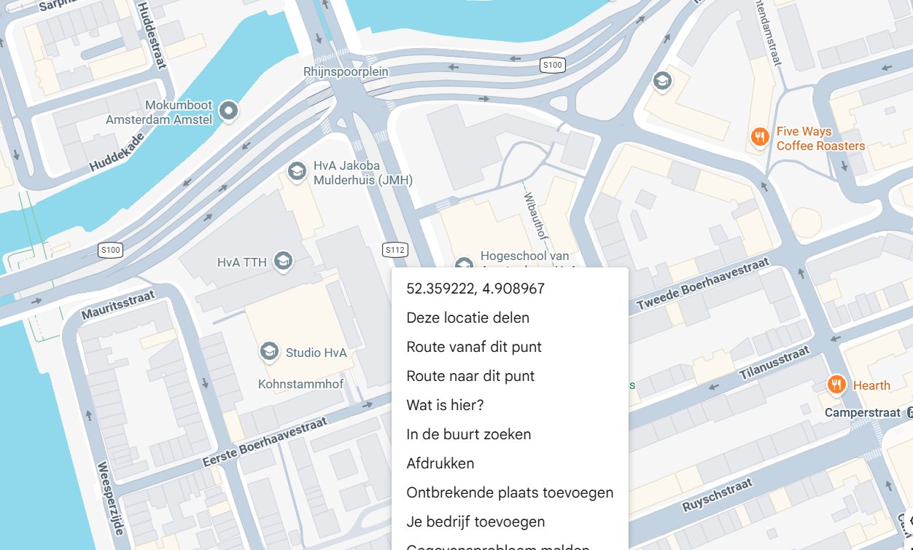
Look for this part in the code:
```cpp
const float MY_LAT = 00.000000;
const float MY_LON = 0.000000;
```
Change these values to the latitude and longitude you found on Google Maps.
For example:
```cpp
const float MY_LAT = 52.359222;
const float MY_LON = 4.908967;
```
## Testing the code
Now that we got our own credentials in. We could test out if it picks everything up and if the code that you changed works. 
Plug in your NodeMCU and send the code to it. Turn on your hotspot as well.
On the top left there in and arrow symbol. If you hover over it, it will give u the option to upload it. Click it to send it to the arduino.
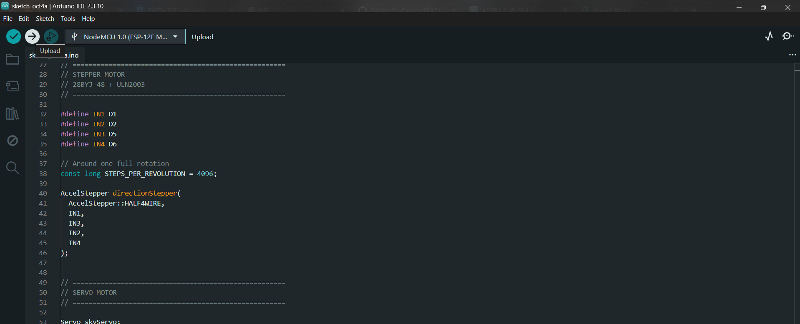
There is a chance that you might get an error code saying that it couldn't find the COM port.
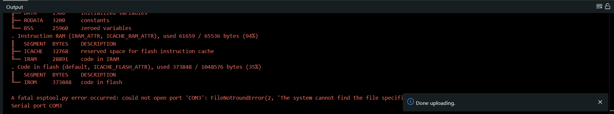
How to fix is by selecting the right COM port above. There is a drop down on the top left of the ArduinoIDE. Click on it and you can see what ports are being used. Select the right port.
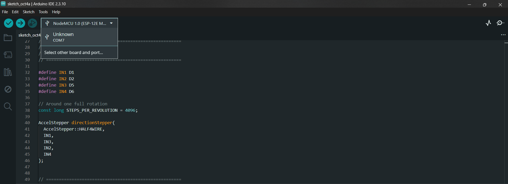
Now send it again. Once done uploading, it will say that it is resetting the pins. That means it has uploaded it. 
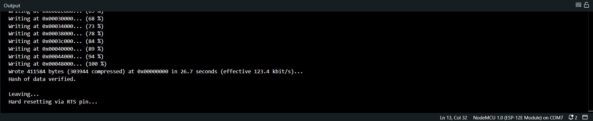

#### Serial monitor
We can now check to see if everything is working. We have to start by opening serial monitor. On the top right there is an icon that looks like a magnifying glass. Click on it. 
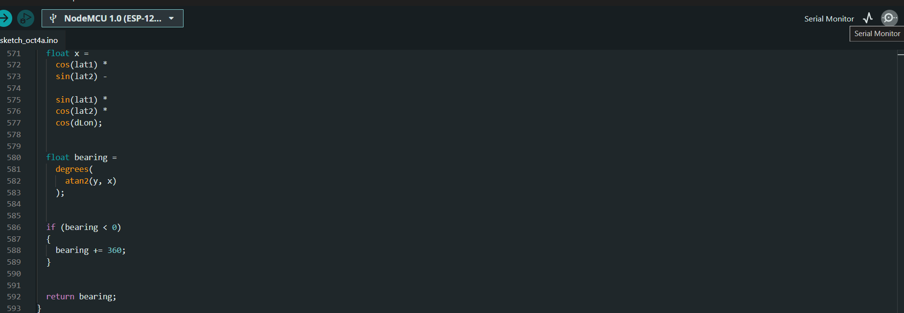
Once it is opened, we need to fix the baud rate. Normally it is set to 9600 baud but we need to switch it to 115200 baud. Click the drop down button and change  it to it. 
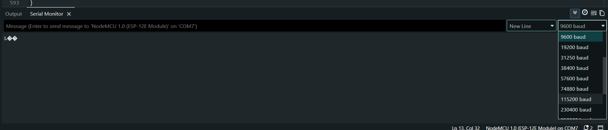
After changing it, upload the code again if nothing pops up. 


#### Working
If everything went well. You can read off the serial monitor that it is connected to the wifi and it is picks out planes that are close to you. 
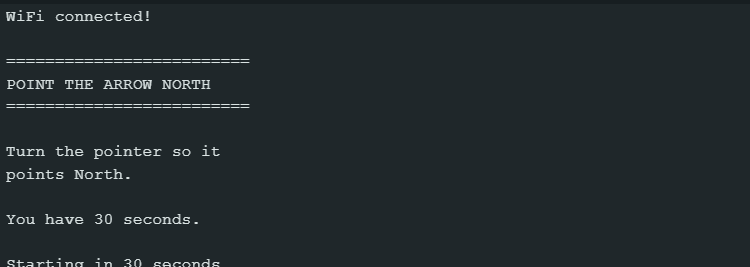
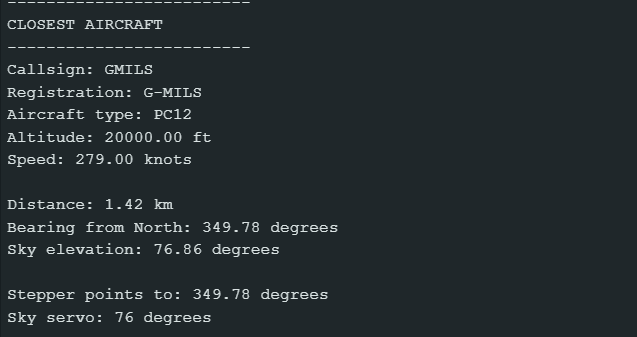

You can check https://adsb.lol/ to see if this pick up is accurate.
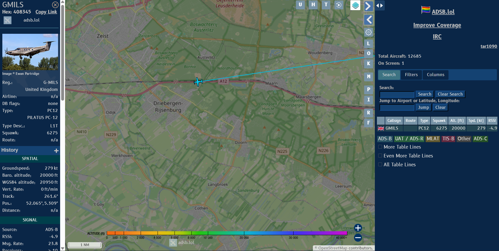

## Wiring
Now connect all the parts together.
SkyPointer uses:
- A 28BYJ-48 stepper motor for left and right movement.
- A 9g servo motor for up and down movement.
- A ULN2003 driver board for the stepper motor.
- An external 5V power supply for the motors.
- 
### Connecting the stepper motor
Plug the 28BYJ-48 stepper motor into the white connector on the ULN2003 board.

Connect:
- D1 : IN1
- D2 : IN2
- D5 : IN3
- D6 : IN4

This matches the code:
```cpp
#define IN1 D1
#define IN2 D2
#define IN3 D5
#define IN4 D6
```

### Connecting the servo motor
A 9g servo normally has three wires:
- Red = 5V
- Brown/Black = GND
- Orange/Yellow = Signal
Connect:
- D7 : Servo signal

This matches the code:
```cpp
skyServo.attach(D7);
```

### Connecting the 5V power supply
Use an external power supply of around 5V and 1–2A.

Connect 5V to:
- ULN2003 VCC
- Servo red wire

Connect GND to:
- ULN2003 GND
- Servo brown/black wire
- NodeMCU GND
The NodeMCU can stay powered through USB.
Important: The NodeMCU GND and power supply GND must be connected together.
Important: Do not power the motors from the NodeMCU 3.3V pin.
### Complete wiring overview

| From | To |
|---|---|
| D1 | ULN2003 IN1 |
| D2 | ULN2003 IN2 |
| D5 | ULN2003 IN3 |
| D6 | ULN2003 IN4 |
| D7 | Servo signal |
| External 5V | ULN2003 VCC |
| External 5V | Servo red wire |
| External GND | ULN2003 GND |
| External GND | Servo GND |
| External GND | NodeMCU GND |

### Wiring diagram
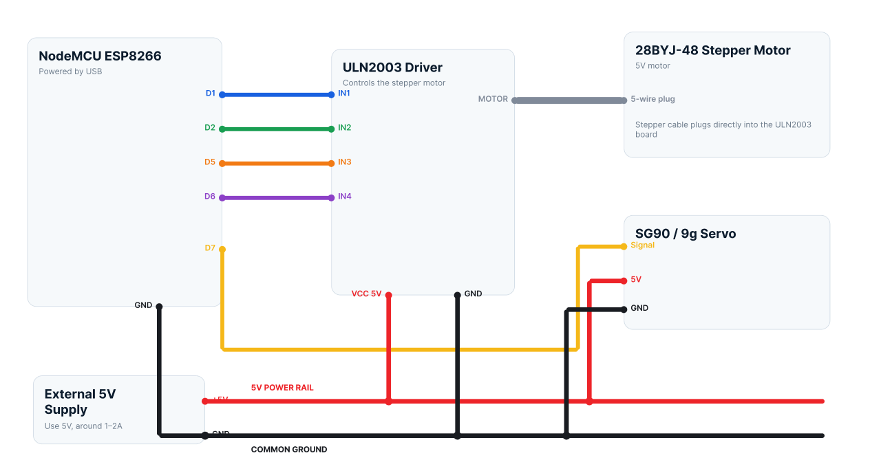

Check all wires before turning the prototype on.

---

## Testing the prototype
Before testing, place the motors in their starting positions.
### Stepper motor
Point the stepper motor to North before the 30 second setup starts.
If your stepper motor does not have a plastic pointer piece, attach something simple to the shaft so you can clearly see which direction it is pointing.

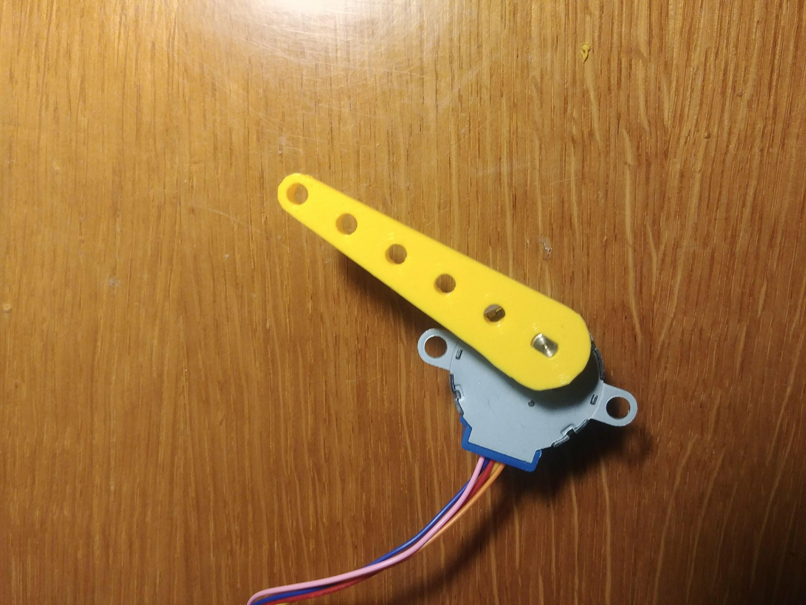

### Servo motor
Place the servo in its starting position so the pointer is facing straight forward.
Attach one of the small plastic servo arms that comes with the servo. This makes it easier to see the up and down movement.

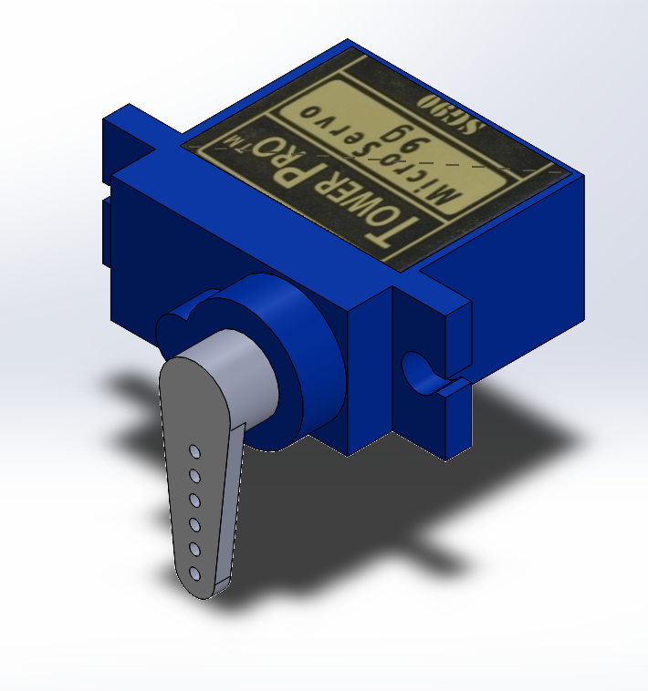

### Test
Turn on SkyPointer and let it complete the 30 second North setup.
After that, the system should find the closest aircraft and move:
- the stepper motor left or right to show the direction
- the servo motor up or down to show how high to look
If both motors move and point in the expected direction, the prototype is working.

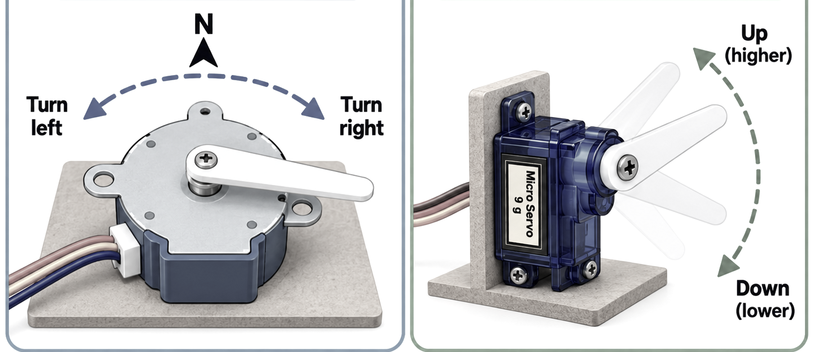

---

## Problems and solutions
While working on SkyPointer, we also ran into a few problems ourselves.
### COM port error
We encountered a problem where Arduino IDE could not find the correct COM port.
To fix it, click the port menu at the top of Arduino IDE and select the port connected to the NodeMCU.
After selecting the correct port, upload the code again.
### Serial Monitor problem
We also had a problem with the Serial Monitor while testing the flight data.
Make sure the Serial Monitor is set to 115200 baud.
Also check that the correct COM port is selected.
### NodeMCU does not connect to Wi-Fi
Check if the Wi-Fi name and password are correct.
Also make sure you are using a 2.4 GHz Wi-Fi network.
### No plane is found
Check if your internet connection works.
You can also increase the search radius in the code.
Look for:
```cpp
const int RADIUS = 50;
```
Increase the radius until SkyPointer detects a plane.
### Stepper motor does not move
Check if the ULN2003 board has power and if D1, D2, D5 and D6 are connected correctly.
Also check if the stepper motor is plugged into the white connector.
### Servo motor does not move
Check if the servo signal wire is connected to D7.
Also check the 5V and GND connections.
### NodeMCU keeps restarting
This is usually a power problem.
Make sure the motors use the external 5V power supply and not the NodeMCU 3.3V pin.

## Sources
These sources were used for the code, libraries and flight data:
- [ADSB.lol API](https://api.adsb.lol/docs)
- [ArduinoJson](https://arduinojson.org/)
- [AccelStepper](https://www.airspayce.com/mikem/arduino/AccelStepper/)
- [ESP8266 Arduino Core](https://arduino-esp8266.readthedocs.io/)
These websites helped with setting up the NodeMCU, reading the API data and controlling the motors.
The AI was used to help write and adjust parts of the code. The code was tested during the project, but mistakes can still happen.
Always check the code and wiring before using the prototype.
